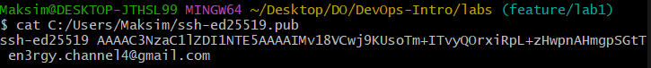

# Report on Lab 1

## Task 1 — SSH Commit Signature Verification

### 1.1 — Importance of Signed Commits

Signed commits have the following advantages:

* The authorship guarantee (a signed commit guarantees that it was created exactly by the person),
* Signing protects the code from unwanted changes via cryptography
* Rising the trust among authors and users

### 1.2 — Evidence of Successful SSH Key Setup and Signed Commit

### 1.3 — Importance in DevOps Workflows

* Trustworthy CI/CD pipeline
* Immutable history providing
* Compliance with rules of security in important spheres of development

## Task 2

PR templates allow faster and standardized description of a contribution
